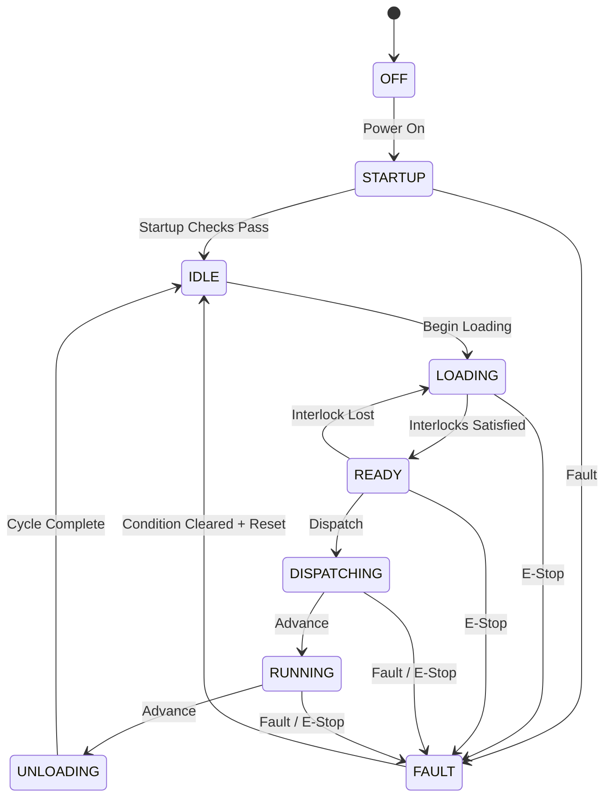

# AttractionOS — Attraction Control System Simulator

AttractionOS is an educational C++ simulation of a fictional theme-park attraction control system. It demonstrates finite-state-machine design, simulated safety interlocks, fault handling, event logging, requirements-driven development, and software testing.

> **Important:** AttractionOS is a portfolio/learning project only. It is not safety-certified software and must not be used to control real rides, machinery, vehicles, or other safety-critical equipment.

## Why I Built It

I built AttractionOS to explore the intersection of software engineering and themed entertainment. The project focuses on how a software controller can model operating states, evaluate multiple simulated inputs before allowing an action, reject invalid commands, record events, and recover from faults.

## Features

- Finite-state attraction controller
- States for OFF, STARTUP, IDLE, LOADING, READY, DISPATCHING, RUNNING, UNLOADING, and FAULT
- Simulated platform-gate and restraint inputs
- Simulated track-clear input
- Emergency-stop simulation
- Dispatch interlocks
- Human-readable dispatch denial reasons
- Fault and reset behavior
- Timestamped event log
- Console operator interface
- Automated controller tests
- Requirements, architecture, and test-plan documentation

## Dispatch Logic

A dispatch request is accepted only while the vehicle is in a dispatchable state and all simulated conditions are satisfied:

- Platform gates are closed
- Restraints are locked
- Track is clear
- Emergency stop is not active

If an interlock is not satisfied, the controller denies dispatch and records the reason in the event log.

## State Machine



## Project Structure

```text
AttractionOS/
├── include/AttractionController.h
├── src/AttractionController.cpp
├── src/main.cpp
├── tests/ControllerTests.cpp
├── docs/SystemRequirements.md
├── docs/Architecture.md
├── docs/TestPlan.md
├── screenshots/
├── CMakeLists.txt
└── README.md
```

## Build

### CMake

```bash
cmake -S . -B build
cmake --build build
```

Run `AttractionOS` from the generated build directory. Build and run the `AttractionOSTests` target to execute the automated tests.

### Visual Studio

Create/open a C++ project, add `src/main.cpp` and `src/AttractionController.cpp` as source files, add `include/AttractionController.h`, and build with C++17 or newer. The included `CMakeLists.txt` can also be opened directly by modern Visual Studio versions that support CMake projects.

## Engineering Concepts Demonstrated

AttractionOS demonstrates requirements decomposition, encapsulation, state-machine modeling, input validation, interlock logic, defensive behavior, event logging, test-case development, and technical documentation.

## Future Development

Possible extensions include a graphical operator interface, additional vehicle/zone simulation, simulated sensor communication, configuration files, expanded automated tests, and a separate microcontroller-based educational prototype using serial communication.

## Disclaimer

This project intentionally simplifies attraction systems for educational purposes. Real amusement-ride and show-control systems require specialized engineering, formal hazard analysis, applicable standards, independent verification, certified hardware/software, redundancy, and extensive testing.
