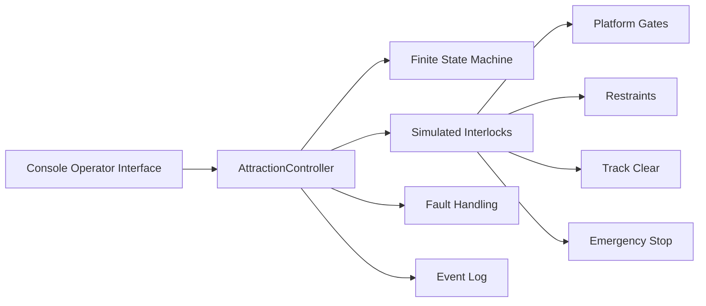

# Architecture

## Overview

AttractionOS separates operator interaction from control logic. `main.cpp` presents the console interface. `AttractionController` owns system state, simulated inputs, transition logic, interlocks, fault handling, and the event log.

## Design Decisions

### Finite-State Machine
A state model restricts the simulator to explicit operating modes and makes transitions easier to reason about and test.

### Encapsulation
The controller's state and simulated inputs are private. Public methods represent permitted commands, preventing the console interface from directly rewriting internal state.

### Interlocks
`canDispatch()` centralizes the conditions required for a simulated dispatch. `dispatchDenialReason()` provides operator-readable feedback when those conditions are not met.

### Fault Handling
Fault-triggering events transition the controller to FAULT. Reset behavior requires the emergency-stop condition to be cleared first.

### Logging
Significant actions are timestamped to provide a simple audit trail useful during testing and troubleshooting.
